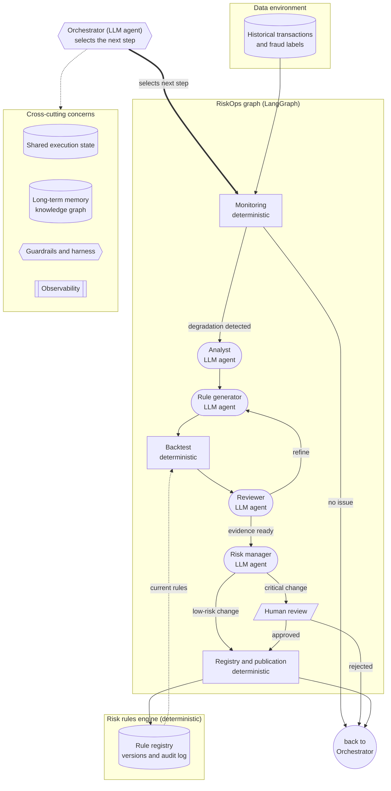

# RiskOps

RiskOps is a multi-agent system for the continuous, auditable, evidence-driven management of the lifecycle of fraud/risk rules: monitoring their performance, diagnosing degradation, proposing candidate rules, backtesting them against historical data, reviewing the evidence, and publishing approved changes.

The agentic layer will be orchestrated as a graph with [LangGraph](https://github.com/langchain-ai/langgraph), combining LLM agents with deterministic components. The rule engine itself is kept separate from the agentic layer and is responsible for deterministic execution, versioning, backtesting, and the official change history.

This repository is a work in progress. See [Status](#status) below for what is currently built.

## Architecture

The target architecture (from the original project proposal) combines a deterministic rule engine with a LangGraph multi-agent graph, shared execution state, long-term memory, guardrails, and observability:



The table below details each graph node's role:

| Node | Type | Role |
|---|---|---|
| Orchestrator | LLM agent | Tracks global state, decides the next step |
| Monitoring | Deterministic | Computes metrics, detects degradation |
| Analyst | LLM agent | Investigates probable causes |
| Rule Generator | LLM agent | Proposes candidate rules |
| Backtest | Deterministic | Measures a candidate's impact on historical data |
| Reviewer | LLM agent | Evaluates the evidence, issues a verdict |
| Risk Manager | LLM agent | Consolidates the decision (approve/reject/escalate) |

Because the process is represented as a graph, a run can end without changes, repeat steps, request refinement, or take different paths depending on context. Long-term memory, observability, and guardrails (permission limits, iteration caps, mandatory human review for critical changes, rollback) are part of the target architecture but not yet implemented.

## Status

**Phase 1 (done): deterministic foundation.** No LLM calls, no LangGraph, no memory/guardrails/observability yet -- this phase built the rule engine and dataset that every later phase depends on.

- `src/riskops/rules/`: a Pydantic rule schema (`schema.py`), a versioned and audited rule store (`store.py`), and a vectorized pandas/numpy rule evaluator (`evaluator.py`).
- `src/riskops/metrics/backtest.py`: classification metrics (detection rate, false positive rate, precision, approval rate) and baseline-vs-candidate ruleset comparison.
- `src/riskops/data/`: download and loading utilities for the experimental dataset.
- `rule_registry/`: the git-tracked, versioned rule registry (one YAML file per rule plus an append-only audit log), populated with a deliberately naive seed baseline (see [Dataset](#dataset) below).
- `tests/`: 28 unit tests covering the schema, store, evaluator, and metrics.

**Phase 2 (not started): the LangGraph agent layer**, designed around the patterns from Anthropic's [Building Effective Agents](https://www.anthropic.com/engineering/building-effective-agents) -- orchestrator-workers for the main graph, evaluator-optimizer for the generate/backtest/review loop, and routing so the agent flow only triggers when the deterministic Monitoring node detects real degradation.

## Dataset

The experimental environment uses the [Bank Account Fraud (BAF) Dataset Suite](https://www.kaggle.com/datasets/sgpjesus/bank-account-fraud-dataset-neurips-2022) (Jesus et al., NeurIPS 2022): synthetic but realistic bank-account-opening applications with named, interpretable features (income, credit risk score, employment status, device/email reuse signals, etc.) and a `fraud_bool` label. This project uses the `Base` variant: 1,000,000 rows, 32 columns, 1.10% fraud rate.

The seed rules in `src/riskops/rules/baf_seed.py` are **deliberately naive and unvalidated** -- plausible-sounding conditions an analyst might write from intuition alone, one of which (`velocity_6h > 5000`) is empirically *worse than random* on this dataset. This is intentional: if the baseline were already statistically optimal, there would be nothing left for the monitoring/analyst/rule-generator agents in later phases to find and improve.

## Setup

Requires Python 3.12+ and [Poetry](https://python-poetry.org/).

```bash
poetry install
```

### Kaggle credentials

Downloading the dataset requires a Kaggle API token. Generate one at `https://www.kaggle.com/settings` -> API -> "Create New Token", then either:

- copy `.env.example` to `.env` and fill in `KAGGLE_USERNAME` and `KAGGLE_KEY` from the downloaded token, or
- place the downloaded `kaggle.json` at `~/.kaggle/kaggle.json`.

### Download the dataset and seed the rule registry

```bash
poetry run python -m riskops.data.download
poetry run python -m riskops.rules.baf_seed
```

### Run the tests

```bash
poetry run pytest
```

## Project layout

```
src/riskops/
  paths.py            # shared filesystem path constants
  rules/
    schema.py          # Rule / Condition / ConditionGroup (Pydantic)
    store.py           # RuleStore: versioned, audited persistence
    evaluator.py        # vectorized rule evaluation over a DataFrame
    baf_seed.py         # seeds the naive baseline described above
  metrics/
    backtest.py         # classification metrics, ruleset comparison
  data/
    download.py         # Kaggle download for the BAF dataset
    loader.py            # loads the dataset into a typed DataFrame
rule_registry/           # git-tracked, versioned rule registry + audit log
tests/                    # unit tests (pytest)
```